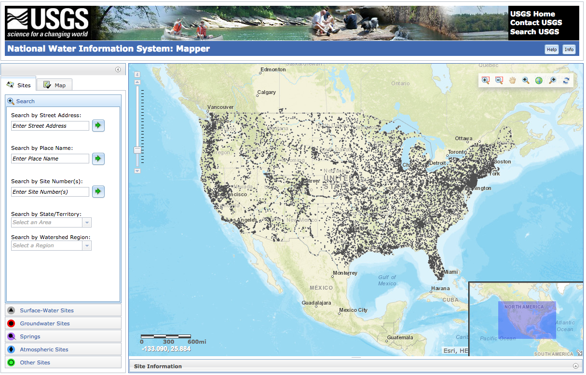
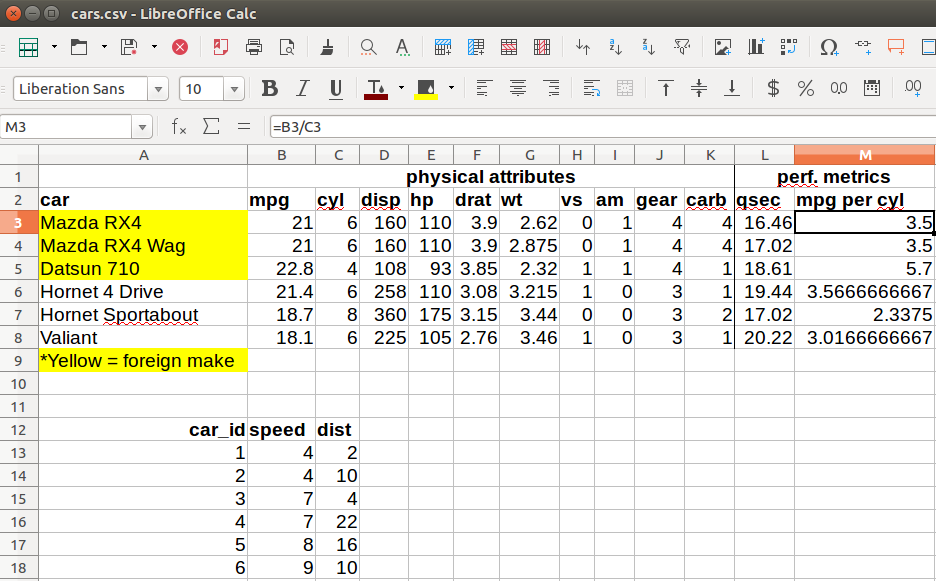
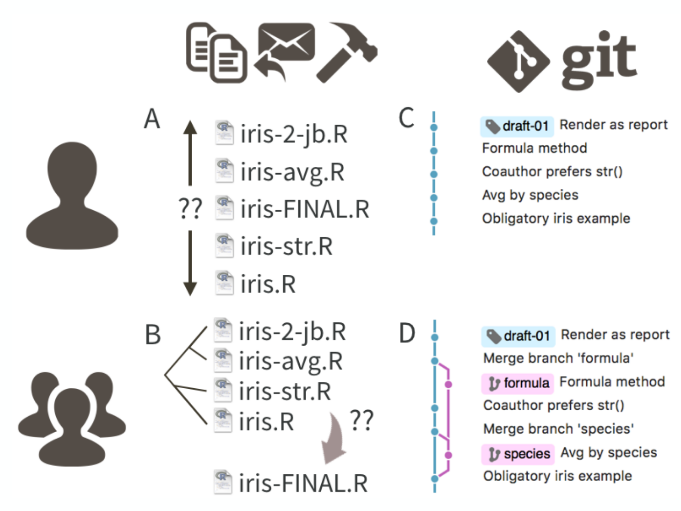
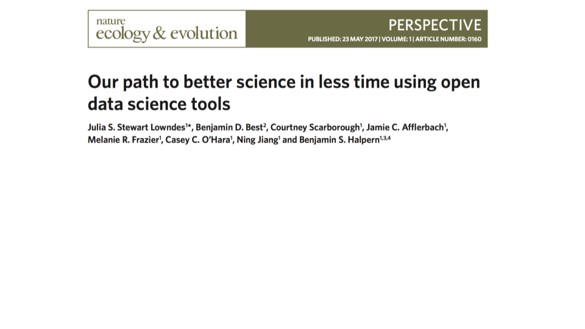
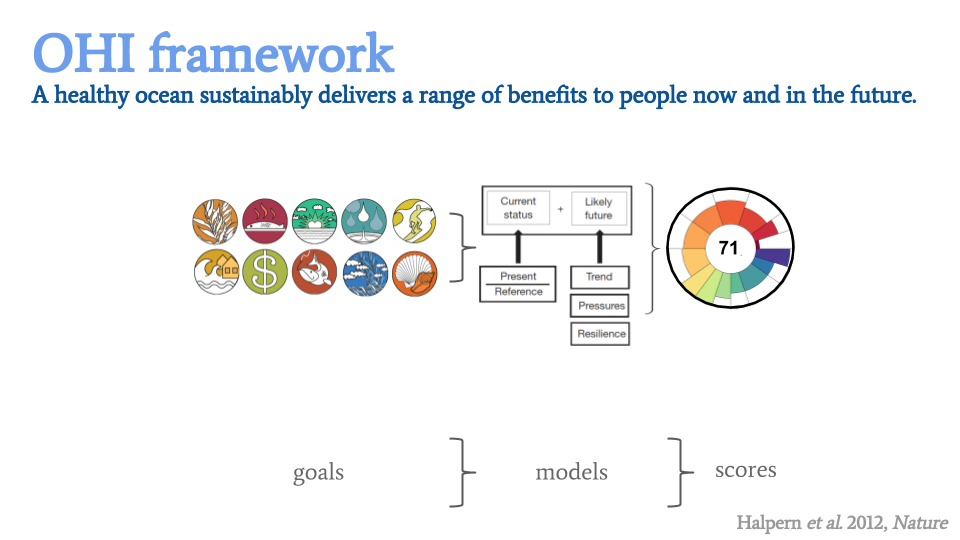

```{r setup, include=FALSE}
options(htmltools.dir.version = FALSE)

```

```{r libraries, include=FALSE}

library(tidyverse)
library(kableExtra)
```

#### research data workflow: this is your world (or it will be soon)


.footnote[J. Bryan from http://stat545.com/]


---

* how do you keep that up-to-date?

--

* what if something changes, what if something needs to be redone - how do you manage that?

--

* why do the results in table 1 not seem to correspond to the results in figure 1?

--

* why were those particular samples omitted?

--

* where did I get these data?

--

* how did I make that figure?


---

#### research data workflow: this is your world (or it will be soon) - .light-blue[now add to that publishing your data and code]


.footnote[J. Bryan from http://stat545.com/]


---
background-image: url(https://media.giphy.com/media/MEtSuIu6qu0HC/giphy.gif)
background-position: 50% 50%
background-size: 50%
class: inverse

<br>

basically, if the thought of redoing your analyses is terrifying 😱 then you are doing it wrong (paraphrasing Jenny Bryan)


---

#### reproducibility

* Replication is the cornerstone of scientific research, with consistent findings from independent investigators the primary means by which scientific evidence accumulates for or against a hypothesis. 

* The **replicability** of a study is related to the chance that an independent experiment targeting the same scientific question will produce a result consistent with the original study. 

* A variation of this concept, referred to as reproducibility, has emerged as a key minimum acceptable standard, especially for heavily computational research. 

* **Reproducibility** is defined as the ability to recompute data analytic results, given an observed data set and knowledge of the data analysis pipeline. 


.footnote[R. Peng [The reproducibility crisis in science: A statistical counterattack](10.1111/j.1740-9713.2015.00827.x)]


---

#### reproducibility, for scientific reasons

##### given your data, someone else can reproduce your exact results

* increased trustworthiness
* more rigorous, reliable science
* learning more from one another's work

"Science should be 'show me', not 'trust me'; it should be 'help me if you can', not 'catch me if you can'."

*-- Philip B. Stark, <a href="https://www.nature.com/articles/d41586-018-05256-0" target="_blank">Nature 2018</a>*
  
  
.footnote[J. Thompson [bit.ly/jlt-rmed2018](bit.ly/jlt-rmed2018)]


---

#### reproducibility, for personal reasons

* Did I mention that subjects with IDs > 100 are actually kangaroos and should be excluded?

* How does that patient have 15 months of treatment when we only followed people for 12 months?

* I won the lottery 👏 - now my coworker is taking over

* Journal reviews back after 8 months! Time for revisions!

  
.footnote[J. Thompson [bit.ly/jlt-rmed2018](bit.ly/jlt-rmed2018)]


---

#### what we will cover (okay, touch on) today

* best practices
  + naming
  + open file formats
  + organization
  + thoughtful curation
  + scripting
  + spreadsheets (and other pointy, clicky stuff)
  + ~~version control~~


---

#### BP [Best Practice]


---

#### BP: naming things - principles for file (and other things) names

--

* machine readable

  - regular expression and globbing friendly
      + avoid spaces, punctuation, accented characters, case sensivity
  - easy to compute on with deliberate use of delimiters
      + example: *2017-11-17_berneilwash_oxygen_day_1.csv*

.footnote[J. Bryan [Naming things](https://speakerdeck.com/jennybc/how-to-name-files)]
  
--

* human readable

  - names contain info about the content
  - easy to figure out what what something is based on the name
      + *2016_salmon_counts.csv* conveys a lot of information about the object, and has far more meaning than *fishData.csv*
  
--

* play well with default ordering
.pull-left[

- 1_file_name.csv
- 11_file_name.csv
- 2_file_name.csv
]
.pull-right[

- 01_file_name.csv
- 02_file_name.csv
- 11_file_name.csv
]


---
class: inverse

#### BP: naming - names matter in times of stress

which set of file(names)s would you prefer at 3 a.m. before a dealine?

.center[
  
]

.footnote[J. Bryan [Naming things](https://speakerdeck.com/jennybc/how-to-name-files)]


---

#### BP: dates matter (a lot!)

.center[

  </img>
  
  .small[comprehensive map of all countries in the world that use MMDDYYYY format]
]
  
**use the ISO 8601 standard for dates (YYYY-MM-DD) everwhere, always without exception ever**


.footnote[J. Bryan [Naming things](https://speakerdeck.com/jennybc/how-to-name-files)]


---

#### BP: employ sound project organization

*your closest collaborator is you six months ago, but you do not reply to emails (K. Broman paraphrasing M. Holder)*

.pull-left[
  
]

.pull-right[
.small[
* segregate all materials for a project in one directory
* organize according to prevailing conventions (e.g., R package structure)
* maintain a clear separation of data, method, and output while unambiguously expressing the relationship among them
* specify the computational environment used for the original analysis
* organize such that another person can know what to expect from the plain meaning of the file and directory names
* include README files
]]

.footnote[K. Broman [Steps toward reproducible research](bit.ly/jsm2016)]


---

#### BP: employ sound project organization
##### research compendium

...a standard and easily recognisable way for organising the digital materials of a project to enable others to inspect, reproduce, and extend the research

general principles:
* organize according to prevailing conventions (e.g., R package structure)
* maintain a clear separation of data, method, and output, while unambiguously expressing the relationship between the three
* specify the computational environment used for the original analysis
* organize such that another person can know what to expect from the plain meaning of the file and directory names

.footnote[<sup>1</sup>[Marwick et al. 2017](https://doi.org/10.7287/peerj.preprints.3192v1)]


---

#### BP: analysis-friendly data

* create analysis-friendly data:
  + each column a variable
  + each row an observation

.footnote[Wilson et al. (2017) [Good enough practices in scientific computing](https://doi.org/10.1371/journal.pcbi.1005510)]


---

#### BP: create analysis-friendly data

* each column a variable
* each row an observation

```{r iris-wide, echo=FALSE}
knitr::kable(head(iris), format = "html")
```

.footnote[Wilson et al. (2017) [Good enough practices in scientific computing](https://doi.org/10.1371/journal.pcbi.1005510)]


---

#### BP: create analysis-friendly data

* each column a variable
* each row an observation

```{r iris-long, echo=FALSE}
library(tidyverse)
knitr::kable(head(gather(head(iris), key = "metric", value = "value", -Species), n=10), format = "html")
```

.footnote[Wilson et al. (2017) [Good enough practices in scientific computing](https://doi.org/10.1371/journal.pcbi.1005510)]


---

#### BP: keep the raw data raw

* save the raw data

.center[
  
]

.footnote[Wilson et al. (2017) [Good enough practices in scientific computing](https://doi.org/10.1371/journal.pcbi.1005510)]


---

#### BP: thoughtful curation

* curate your data in a way that you would like to receive it

.center[
  
]

.footnote[Wilson et al. (2017) [Good enough practices in scientific computing](https://doi.org/10.1371/journal.pcbi.1005510)]


---

#### BP: open file formats

* use open file formats (e.g., csv not xlsx)

<br>
<br>

.center[
  
]

.footnote[Wilson et al. (2017) [Good enough practices in scientific computing](https://doi.org/10.1371/journal.pcbi.1005510)]


---
background-image: url(https://media.giphy.com/media/3orif8zlUQh32KTURy/giphy.gif)
background-position: 50% 50%
background-size: 50%
class: inverse

#### BP: record everything

* record all the steps of the data process


---

#### BP: everything in a script

.light-blue[The most basic principle for reproducible research is: **do everything via code**]

* downloading data from the web 
* converting an Excel file to CSV
* renaming columns or variables 
* omitting bad samples or data points
* *...do all of these with programatically*

You will be tempted to open up a data file and hand-edit. But if you get a revised version of that file, you will need to do it again, and it will be harder to figure out what it was that you did.

Some things are more cumbersome via code but you will save time in the long run.

.footnote[K. Broman [Steps toward reproducible research](bit.ly/jsm2016)]


---

#### BP: learn a language, any language, just do it

.pull-left[
  
]

.pull-right[
  
]


---

#### spreadsheets: the dark side

.center[
  
]


---

#### spreadsheets: the 2nd best tool for everything

.pull-left[
  
]

.pull-right[

the beauty and the travesty of spreadsheets is that they allow you to do just about anything

* data in merged cells
* data in formatting
* small multiples
* data in formulas

]

--

**BP: use open file formats (e.g., CSV, not XLSX)**

.footnote[J. Bryan [Spreadsheets](https://speakerdeck.com/jennybc/spreadsheets)]


---

#### spreadsheets versus scripting

consider, we want to remove samples that we feel may have been contaminated...

.pull-left[

  **in a R script**
  <hr>
  ```r
  some work...
  ```
  

.small[*comment code:*
.light-blue[remove samples 4 and 5 that may have been compromised due to wading upstream during sampling]]
  
  ```r
  chemistry_data %>%
    filter(!sampleID %in% c(4,5))
  ```
  
  ```r
  ...more work
  ```
]

.pull-right[

  **in a spreadsheet**
  <hr>
  
  
]


---
class: inverse

#### BP: version control

.center[
  
]


---

#### version control::git

* git watches repositories (like a directory) for changes
* git asks that you describe changes when they are made
* git remembers old versions if you need them
* git also keeps an eye out for conflicts, and forces you to resolve them

.footnote[Jeff Goldsmith ["Git"](https://speakerdeck.com/jeffgoldsmith/dsi-git-and-github)]


---

#### git + GitHub 

when combined with a service such as GitHub

* ...allows multiple people to contribute to the same repository, and does all of the aforementioned for everyone at once

.center[
  
]

.footnote[Jeff Goldsmith ["Git"](https://speakerdeck.com/jeffgoldsmith/dsi-git-and-github)]


---

#### version control: git

.light-blue[tame the chaos] 👏

.center[
  
]


---
class: inverse

#### version control: git

.center[
  
]


---
background-image: url(https://media.giphy.com/media/PnXRAFOJFCt3i/giphy.gif)
background-position: 50% 50%
background-size: 50%
class: inverse

#### I am not saying it is easy


---

#### OHI: nature ecology & evolution

.center[
  
]

.footnote[Lowndes et al. (2017) [Our path to better science in less time using open data science tools](https://www.nature.com/articles/s41559-017-0160)]


---

#### OHI: framework

.center[
  
]

.footnote[Lowndes et al. (2017) [Our path to better science in less time using open data science tools](https://www.nature.com/articles/s41559-017-0160)]


---

#### OHI: evolution of a workflow

.center[
  
]

.footnote[Lowndes et al. (2017) [Our path to better science in less time using open data science tools](https://www.nature.com/articles/s41559-017-0160)]


---

#### BP: forethought

strive for reproducibility from the outset

"It's not thinking, 'This is easiest for myself right now.' It's thinking, 'When I'm working on this next week, next month, right before I graduate — how do I set myself up so that it's easier later?'

*-- Julia Stewart Lowndes in "A toolkit for data transparency takes shape", [Nature 2018](https://www.nature.com/articles/d41586-018-05256-0)*
  
.footnote[J. Thompson [bit.ly/jlt-rmed2018](bit.ly/jlt-rmed2018)]


---

#### embrace openness

chaos in your code, file structure, and other components that make up your workflow may make you reluctant to share it with others - a sound workflow will make you more likely to <font style="color:#FFA500">share</font> and to <font style="color:#FFA500">collaborate</font>

.center[
  </img>
]

.footnote[<sup>1</sup>[Marwick et al. 2017](https://doi.org/10.7287/peerj.preprints.3192v1)]


---

#### embrace openness

.center[
  </img>
]


---

#### embrace openness

<br>

.pull-left[
  <div style="margin-top:0%;">
    </img>
  </div>
] 

.pull-right[
  <div style="margin-top:15%;">
    </img>
  </div>
]


---

#### orcid

.center[
  
]

[orcid.org](https://orcid.org/)
